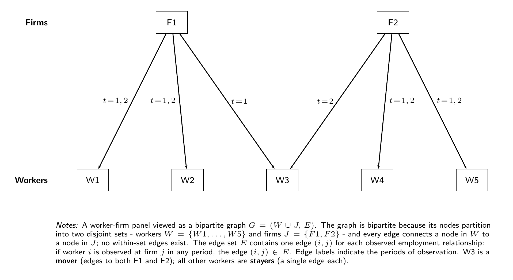

# within

`within` provides high-performance solvers for projecting out high-dimensional fixed effects in regression problems.

By the Frisch-Waugh-Lovell theorem, estimating a regression of the form *y = Xβ + Dα + ε* reduces to a sequence of least-squares projections, one for y and one for each column of X, followed by a cheap regression fit on the resulting residuals. The projection step - solving the normal equations *D'Dx = D'z* — is the computational bottleneck.

Fixed-effects problems have a natural graph structure: each observation is an edge linking the factor levels it belongs to. In a worker-firm panel, this gives a bipartite graph where edges are employment spells:

<p align="center">
  
</p>

`within` exploits this structure using iterative solvers (preconditioned CG, right-preconditioned GMRES) with domain decomposition (Schwarz) preconditioners backed by approximate Cholesky local solvers (Correia 2016; Gao, Kyng & Spielman 2025).

## Installation

Requires Python >= 3.9.

```bash
pip install within
```

## Python Quickstart

`within`'s main estimation functions are `solve` and `solve_batch`. Below we show how to apply them to a worker-firm panel to estimate a wage regression via the Frisch-Waugh-Lovell theorem:

```python
from within import solve, solve_batch, make_akm_panel
import numpy as np

# Generate a synthetic employer-employee panel
data = make_akm_panel(n_workers=20_000, n_firms=2_000, n_years=10)
fe, y, X, beta_true = data["fe"], data["y"], data["X"], data["beta_true"]

# Demean y and X jointly, then OLS on residuals
result = solve_batch(fe, np.column_stack([y, X]))
Y_dm, X_dm = result.demeaned[:, 0], result.demeaned[:, 1:]
beta_hat = np.linalg.lstsq(X_dm, Y_dm, rcond=None)[0]

print(f"True β:      {beta_true}")
print(f"Estimated β: {np.round(beta_hat, 4)}")
print(f"converged: {result.converged}  iters: {result.iterations}")
# True β:      [0.05 0.02]
# Estimated β: [0.05 0.02]
# converged: [True, False, False]  iters: [10, 8, 8]
```

For a single column, use `solve`:

```python
result = solve(fe, y)
print(f"converged={result.converged}  iters={result.iterations}  time={result.time_total:.3f}s")
```

### Solver methods

| Class | Description |
|---|---|
| `CG(tol, maxiter, operator)` | Conjugate gradient on the normal equations. Default solver. |
| `GMRES(tol, maxiter, restart, operator)` | Right-preconditioned GMRES on the normal equations. |

```python
# Tighter tolerance with CG
result = solve(fe, y, config=CG(tol=1e-12, maxiter=2000))

# GMRES with custom restart
result = solve(fe, y, config=GMRES(tol=1e-10, restart=50))
```

### Preconditioners

| Class | Description |
|---|---|
| `AdditiveSchwarz(...)` | Additive one-level Schwarz (default). Use with `CG` or `GMRES`. |
| `MultiplicativeSchwarz(...)` | Multiplicative one-level Schwarz. Use with `GMRES` only. |

```python
# Unpreconditioned solve
result = solve(fe, y, preconditioner=Preconditioner.Off)

# Multiplicative Schwarz with GMRES
result = solve(fe, y, config=GMRES(), preconditioner=MultiplicativeSchwarz())
```

## License

MIT

## References

- Correia, Sergio. "A feasible estimator for linear models with multi-way fixed effects." *Preprint* at http://scorreia.com/research/hdfe.pdf (2016).
- Gao, Y., Kyng, R. & Spielman, D. A. (2025). AC(k): Robust Solution of Laplacian Equations by Randomized Approximate Cholesky Factorization. *SIAM Journal on Scientific Computing*.
- Toselli & Widlund (2005). *Domain Decomposition Methods — Algorithms and Theory*. Springer.
- Xu, J. (1992). Iterative Methods by Space Decomposition and Subspace Correction. *SIAM Review*, 34(4), 581--613.


## Development 

### `pixi` tasks

Uses [pixi](https://pixi.sh) as the task runner.

```bash
pixi run develop          # Build Rust extension (release mode)
pixi run test             # Rebuild + pytest
cargo test --workspace    # Rust tests only
cargo bench -p within     # Criterion benchmarks
pixi run bench run all    # Python benchmarks
```

Rust changes require rebuilding before running Python code (`pixi run develop`).

### Rust quickstart

```bash
cargo add within
```

See [`crates/within/README.md`](crates/within/README.md) for Rust API usage and architecture details.

### Project structure

```
crates/
  schwarz-precond/   Generic domain decomposition library (traits, solvers, Schwarz preconditioners)
  within/            Core fixed-effects solver (observation stores, domains, operators, orchestration)
  within-py/         PyO3 bridge 
python/within/       Python package re-exporting the Rust extension
benchmarks/          Python benchmark framework
```
