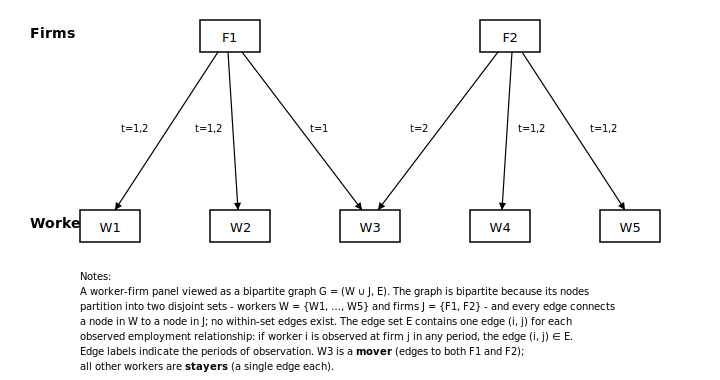

# within

`within` provides high-performance solvers for projecting out high-dimensional fixed effects in regression problems.

By the Frisch-Waugh-Lovell theorem, estimating a regression of the form *y = Xβ + Dα + ε* reduces to a sequence of least-squares projections, one for y and one for each column of X, followed by a cheap regression fit on the resulting residuals. The projection step, solving the normal equations *D'Du = D'z*, is the computational bottleneck that `within` aims to speed up.

Fixed-effects problems have a natural graph structure: each observation is an edge linking the factor levels it belongs to. In a worker-firm panel, this gives a bipartite graph where edges are employment spells:

<p align="center">
  
</p>

`within` exploits this structure using iterative solvers (preconditioned CG, right-preconditioned GMRES) with domain decomposition (Schwarz) preconditioners backed by approximate Cholesky local solvers (Correia 2016; Gao, Kyng & Spielman 2025).

## Installation

Requires Python >= 3.9.

## Python Quickstart

`within`'s main estimation functions are `solve` and `solve_batch`. Below we show how to apply them to a worker-firm panel to estimate a wage regression via the Frisch-Waugh-Lovell theorem:

```python
from within import solve, solve_batch, make_akm_panel, CG, GMRES, Preconditioner, MultiplicativeSchwarz
import numpy as np

# Generate a synthetic employer-employee panel
data = make_akm_panel(n_workers=20_000, n_firms=2_000, n_years=10)
fe, y, X, beta_true = data["fe"], data["y"], data["X"], data["beta_true"]
fe = np.asfortranarray(fe) # for best performance

# Demean y and X jointly, then OLS on residuals
result = solve_batch(fe, np.column_stack([y, X]))
Y_dm, X_dm = result.demeaned[:, 0], result.demeaned[:, 1:]
beta_hat = np.linalg.lstsq(X_dm, Y_dm, rcond=None)[0]

print(f"True β:      {beta_true}")
print(f"Estimated β: {np.round(beta_hat, 4)}")
print(f"converged: {result.converged}  iters: {result.iterations}")
# True β:      [0.05 0.02]
# Estimated β: [0.05 0.02]
# converged: [True, False, False]  iters: [10, 8, 8]
```

For a single column, use `solve`:

```python
result = solve(fe, y)
print(f"converged={result.converged}  iters={result.iterations}  time={result.time_total:.3f}s")
```

## Python API

### High-level functions

| Function | Description |
|---|---|
| `solve(categories, y, config?, weights?, preconditioner?)` | Solve a single right-hand side. Returns `SolveResult`. |
| `solve_batch(categories, Y, config?, weights?, preconditioner?)` | Solve multiple RHS vectors in parallel. `Y` has shape `(n_obs, k)`. Returns `BatchSolveResult`. |

`categories` is a 2-D `uint32` array of shape `(n_obs, n_factors)`. A `UserWarning` is emitted when a C-contiguous array is passed — use `np.asfortranarray(categories)` for best performance.

### Persistent solver

For repeated solves with the same design matrix, `Solver` builds the preconditioner once and reuses it.

```python
from within import Solver

solver = Solver(fe)
r = solver.solve(y)                            # reuses preconditioner
r = solver.solve_batch(np.column_stack([y, X]))

precond = solver.preconditioner()              # picklable
solver2 = Solver(fe, preconditioner=precond)   # skip re-factorization
```

| Property / Method | Description |
|---|---|
| `Solver(categories, config?, weights?, preconditioner?)` | Build solver. Factorizes the preconditioner at construction. |
| `.solve(y)` | Solve a single RHS. Returns `SolveResult`. |
| `.solve_batch(Y)` | Solve multiple RHS columns in parallel. Returns `BatchSolveResult`. |
| `.preconditioner()` | Return the built `FePreconditioner` (picklable), or `None`. |


### Solver configuration

| Class | Description |
|---|---|
| `CG(tol=1e-8, maxiter=1000, operator=Implicit)` | Conjugate gradient on the normal equations. Default solver. |
| `GMRES(tol=1e-8, maxiter=1000, restart=30, operator=Implicit)` | Right-preconditioned GMRES. |

### Preconditioners

| Class | Description |
|---|---|
| `AdditiveSchwarz(local_solver?)` | Additive one-level Schwarz. Works with CG and GMRES. |
| `MultiplicativeSchwarz(local_solver?)` | Multiplicative one-level Schwarz. GMRES only. |
| `Preconditioner.Off` | Disable preconditioning. |

Pass `None` (the default) to use additive Schwarz with the default local solver.

### Local solver configuration (advanced)

| Class | Description |
|---|---|
| `SchurComplement(approx_chol?, approx_schur?, dense_threshold=24)` | Schur complement reduction with approximate Cholesky on the reduced system. Default local solver. |
| `FullSddm(approx_chol?)` | Full bipartite SDDM factorized via approximate Cholesky. |
| `ApproxCholConfig(seed=0, split=1)` | Approximate Cholesky parameters. |
| `ApproxSchurConfig(seed=0, split=1)` | Approximate Schur complement sampling parameters. |

### Result types

**`SolveResult`**: `x` (coefficients), `demeaned` (residuals), `converged`, `iterations`, `residual`, `time_total`, `time_setup`, `time_solve`.

**`BatchSolveResult`**: Same fields, with `converged`, `iterations`, `residual`, and `time_solve` as lists (one entry per RHS).

## Rust API

```rust
use ndarray::Array2;
use within::{solve, SolverParams, KrylovMethod, Preconditioner, LocalSolverConfig};

let categories = /* Array2<u32> of shape (n_obs, n_factors) */;
let y: &[f64] = /* response vector */;

// Default: CG + additive Schwarz
let r = solve(categories.view(), &y, None, &SolverParams::default(), None)?;
assert!(r.converged);

// GMRES + multiplicative Schwarz
let params = SolverParams {
    krylov: KrylovMethod::Gmres { restart: 30 },
    ..SolverParams::default()
};
let precond = Preconditioner::Multiplicative(LocalSolverConfig::default());
let r = solve(categories.view(), &y, None, &params, Some(&precond))?;
```

Persistent solver — build once, solve many:

```rust
use within::Solver;

let solver = Solver::new(categories.view(), None, &SolverParams::default(), None)?;
let r1 = solver.solve(&y)?;
let r2 = solver.solve(&another_y)?;  // reuses preconditioner
```

| Type | Variants / Fields |
|---|---|
| `SolverParams` | `krylov: KrylovMethod`, `operator: OperatorRepr`, `tol: f64`, `maxiter: usize` |
| `KrylovMethod` | `Cg` (default), `Gmres { restart }` |
| `OperatorRepr` | `Implicit` (default, matrix-free D'WD), `Explicit` (CSR Gramian) |
| `Preconditioner` | `Additive(LocalSolverConfig)`, `Multiplicative(LocalSolverConfig)` |
| `LocalSolverConfig` | `SchurComplement { approx_chol, approx_schur, dense_threshold }`, `FullSddm { approx_chol }` |

### Lower-level types

The crate exposes its internals for advanced use:

| Module | Key types |
|---|---|
| `observation` | `FactorMajorStore`, `ArrayStore`, `ObservationStore` trait |
| `domain` | `WeightedDesign`, `FixedEffectsDesign`, `Subdomain` |
| `operator` | `Gramian` (CSR), `GramianOperator` (implicit), `DesignOperator`, `build_schwarz`, `FeSchwarz` |
| `solver` | `Solver<S: ObservationStore>` — generic persistent solver |

### Feature flags

| Feature | Default | Effect |
|---|---|---|
| `ndarray` | yes | Enables `from_array` constructors for `ndarray::ArrayView2` interop. |

## Project structure

```
crates/
  schwarz-precond/   Generic domain decomposition library (traits, solvers, Schwarz preconditioners)
  within/            Core fixed-effects solver (observation stores, domains, operators, orchestration)
  within-py/         PyO3 bridge (cdylib → within._within)
python/within/       Python package re-exporting the Rust extension
benchmarks/          Python benchmark framework
```

## Development

Uses [pixi](https://pixi.sh) as the task runner.

```bash
pixi run develop          # Build Rust extension (release mode)
pixi run test             # Rebuild + pytest
cargo test --workspace    # Rust tests only
cargo bench -p within     # Criterion benchmarks
pixi run bench run all    # Python benchmarks
```

Rust changes require rebuilding before running Python code (`pixi run develop`).

## License

MIT

## References

- Correia, Sergio. "A feasible estimator for linear models with multi-way fixed effects." *Preprint* at http://scorreia.com/research/hdfe.pdf (2016).
- Gao, Y., Kyng, R. & Spielman, D. A. (2025). AC(k): Robust Solution of Laplacian Equations by Randomized Approximate Cholesky Factorization. *SIAM Journal on Scientific Computing*.
- Toselli & Widlund (2005). *Domain Decomposition Methods — Algorithms and Theory*. Springer.
- Xu, J. (1992). Iterative Methods by Space Decomposition and Subspace Correction. *SIAM Review*, 34(4), 581--613.
