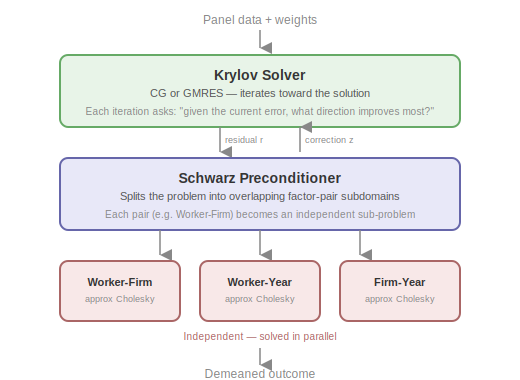
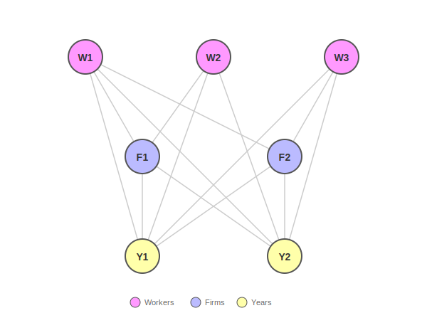
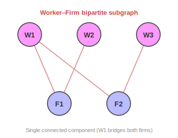
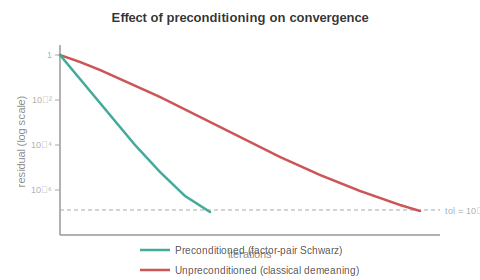
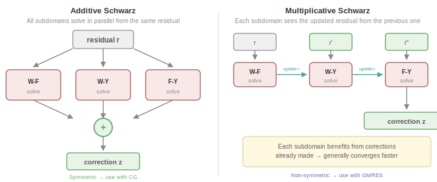

# Part 2: Preconditioned Krylov Solvers and Schwarz Decomposition

This is Part 2 of the algorithm documentation for the `within` solver. It describes the three-layer solver architecture, the graph structure that drives the decomposition, the Krylov outer iteration, and the Schwarz preconditioner framework.

**Series overview**:
- [Part 1: Fixed Effects and Block Iterative Methods](1_fixed_effects_and_block_methods.md)
- **Part 2: Preconditioned Krylov Solvers and Schwarz Decomposition** (this document)
- [Part 3: Local Solvers and Approximate Cholesky](3_local_solvers.md)

**Prerequisites**: Part 1 (problem formulation, Gramian block structure, demeaning as multiplicative Schwarz).

---

## 1. Three-Layer Architecture

The solver combines three algorithmic ideas in a layered architecture:

1. A **Krylov solver** - either conjugate gradient (CG) or restarted GMRES - iterates toward the solution, using the preconditioner to accelerate convergence.

2. A **Schwarz preconditioner** decomposes the global system into overlapping subdomains derived from the Gramian's block structure, applies local solves independently (additive) or sequentially (multiplicative), and combines corrections using partition-of-unity weights.

3. **Local solvers**. Each subdomain system is a bipartite Gramian block that becomes a graph Laplacian after a sign-flip, factored in nearly-linear time using approximate Cholesky (see [Part 3](3_local_solvers.md)).

### Why this combination

As discussed in [Part 1, Section 5.2](1_fixed_effects_and_block_methods.md#52-the-key-idea-factor-pair-subdomains), the central trade-off for solving the fixed effects problem is between **exact solves on single factors** (demeaning via the MAP algorithm) vs. **approximate solves on factor pairs** (`within`). The three layers exist to make this trade-off pay off:

- **Block-bipartite structure**: each factor pair $(q,r)$ induces a bipartite subgraph. Connected components of these subgraphs form natural subdomains with limited overlap.

- **Laplacian connection**: after a sign-flip transformation (Section 2), each bipartite block becomes a graph Laplacian. This unlocks nearly-linear-time *approximate* solvers - exact factorization would be too expensive for large subdomains, but the approximate Cholesky factorization ([Part 3](3_local_solvers.md)) produces factors that are accurate enough to make the Krylov solver converge in very few iterations.

- **Spectral acceleration**: the Krylov outer solver compensates for the approximate nature of the local solves. Even though each preconditioner application is inexact, the Krylov iteration refines the solution globally. The preconditioner clusters the eigenvalues of $M^{-1}G$, reducing the iteration count from $O(\sqrt{\kappa})$ (unpreconditioned demeaning) to a count determined by the quality of the local solves rather than the global condition number.

---

## 2. Graph Structure of the Gramian

Part 1 derived the block structure of $G = D^\top W D$, with diagonal blocks $D_q$ and cross-tabulation blocks $C_{qr}$. It is convenient to write $G = \mathcal{D} + \mathcal{C}$, where $\mathcal{D} = \operatorname{block-diag}(D_1, \ldots, D_Q)$ collects the diagonal blocks and $\mathcal{C}$ collects the off-diagonal cross-tabulation blocks. This section describes the graph-theoretic properties that drive the domain decomposition.

### 2.1 Factor-pair bipartite blocks

Each cross-tabulation block $C_{qr}$ defines a weighted bipartite graph: the left vertices are the $m_q$ levels of factor $q$, the right vertices are the $m_r$ levels of factor $r$, and the edge weight between $j$ and $k$ is $C_{qr}[j,k]$ (nonzero when at least one observation has $f_q = j$ and $f_r = k$).

The full factor-pair block is:

$$
G_{qr} = \begin{pmatrix} D_q & C_{qr} \\ C_{qr}^\top & D_r \end{pmatrix}
$$

### 2.2 Connected components as subdomains

The bipartite graph of $C_{qr}$ may have multiple connected components. Each connected component defines an independent subproblem and becomes a subdomain of the Schwarz preconditioner.

| Full interaction graph | Worker–Firm subgraph |
|:---:|:---:|
|  |  |

Continuing the Worker/Firm/Year example from [Part 1](1_fixed_effects_and_block_methods.md): extracting just the Worker–Firm edges (right) gives the bipartite graph of $C_{WF}$. Because W1 worked at both firms, the graph is connected — there is a path between any two nodes — so all 5 DOFs belong to a single subdomain. Without W1's mobility, the graph would split into two components: {W1, W2, F1} and {W3, F2}, yielding two independent subdomains.

### 2.3 Laplacian connection via sign-flip

The bipartite block $G_{qr}$ has non-negative off-diagonal entries, so it is not directly a graph Laplacian. Negating the off-diagonal blocks produces one:

$$
L_{qr} = \begin{pmatrix} D_q & -C_{qr} \\ -C_{qr}^\top & D_r \end{pmatrix}
$$

This is a valid graph Laplacian: symmetric, non-positive off-diagonal entries, and zero row sums. The zero row-sum property holds because every observation at level $j$ of factor $q$ has exactly one level in factor $r$, so $D_q[j,j] = \sum_k C_{qr}[j,k]$.

The transform is an involution: solving $L_{qr} z = b$ and flipping the sign of one block recovers the solution to the original system. This Laplacian structure is exploited by the local solvers ([Part 3](3_local_solvers.md)).

---

## 3. Krylov Outer Iteration

The outer solver iteratively solves $G\alpha = b$ where $b = D^\top W y$, building a sequence of improving approximations $\alpha_0, \alpha_1, \ldots$ At each step it computes the residual $r_k = b - G\alpha_k$, applies the preconditioner to obtain a search direction $z_k = M^{-1}r_k$, and updates the solution. The preconditioner $M^{-1}$ — the Schwarz solver — is a cheap approximate inverse of $G$ that is not exact, but accurate enough so that the iteration converges in far fewer steps than an unpreconditioned solver would require.

### 3.1 Solver selection

From the class of Kyrlov solvers, we provide two algorithms: 

The choice of solver depends on whether the preconditioner is symmetric; this in turn depends on whether additive or multiplicative Schwarz is used (see [Section 4](#4-schwarz-domain-decomposition)):

- **CG** (conjugate gradient) is used when the preconditioner is symmetric — this is the case with additive Schwarz. CG is optimal for symmetric positive-definite systems.

- **GMRES** (generalized minimal residual) is used when the preconditioner is non-symmetric — this is the case with multiplicative Schwarz, where the sequential processing breaks symmetry.

### 3.2 Convergence criterion

The solver converges when the normalized residual $\|r_k\|_2 / \|b\|_2 \leq \text{tol}$ (default $10^{-8}$). The residual $r_k = b - G\alpha_k$ measures how well the current $\alpha_k$ satisfies the normal equations — it is a property of the linear system, not a direct measure of how accurately the fixed effects have been removed from $y$. In practice the two are closely linked: a small residual implies that $\alpha_k$ is close to the true solution $\alpha^\ast$, and hence that the demeaned residuals $e = y - D\alpha_k$ are accurate.

**Iterative refinement.** When higher accuracy is needed, the solution can be improved by solving $G\delta = (b - G\alpha_0)$ and updating $\alpha \leftarrow \alpha_0 + \delta$. Each refinement step reuses the existing preconditioner and reduces the error by roughly the same factor as the original solve.

---

## 4. Schwarz Domain Decomposition

[Part 1, Section 5](1_fixed_effects_and_block_methods.md#5-the-domain-decomposition-perspective) introduced the Schwarz perspective and contrasted factor-level with factor-pair decompositions. This section provides the full algorithmic details.

### 4.1 How it works

The Schwarz preconditioner decomposes the global system into overlapping subdomains - one per factor pair - and applies local solves to each. The local operator on subdomain $i$ is $A_i = R_i G R_i^\top$, the principal submatrix of $G$ restricted to that subdomain's DOFs.

Two variants exist - additive and multiplicative - differing in how the local corrections are combined:

### 4.2 Partition of unity

When subdomains overlap (a DOF belongs to multiple subdomains), corrections must be weighted to avoid double-counting:

Each DOF $j$ that appears in $c_j$ subdomains gets weight $\omega_j = 1/\sqrt{c_j}$ in each subdomain. The weights are applied on both the restriction and prolongation sides, so they contribute $c_j \times \omega_j^2 = 1$ - correctly partitioning the correction. In the running example, every DOF appears in exactly 2 subdomains, so every weight is $\omega_j = 1/\sqrt{2}$.

### 4.3 Additive Schwarz

The additive Schwarz preconditioner applies all local solves independently and sums the weighted corrections:

$$
M^{-1}_{\text{add}} r = \sum_{i=1}^{N_s} R_i^\top \tilde{D}_i A_i^+ \tilde{D}_i R_i r
$$

Each subdomain restricts the global residual to its local DOFs (with partition-of-unity weights applied on input), solves the local system, and prolongates the correction back to the global space (with weights applied on output). All subdomains are processed independently and in parallel. Because the weighting is applied symmetrically on both sides, the resulting preconditioner is symmetric, making it compatible with CG.

### 4.4 Multiplicative Schwarz

The multiplicative variant processes subdomains sequentially, updating the residual after each correction. Each subdomain "sees" corrections from earlier subdomains, generally improving convergence versus additive Schwarz. However, the sequential processing makes the preconditioner non-symmetric, requiring the use of the GMRES solver.

### 4.5 Subdomain construction

Subdomains are derived from the factor-pair structure of the Gramian:

1. **Enumerate factor pairs**: all $\binom{Q}{2}$ unordered pairs $(q, r)$.
2. **Build cross-tabulation**: for each pair, scan observations to build the sparse bipartite block $C_{qr}$ and diagonal vectors $D_q$, $D_r$.
3. **Find connected components**: run DFS (depth-first search — a standard graph traversal that follows edges recursively until no new nodes are reachable) on the bipartite graph of $C_{qr}$ to identify independent components.
4. **Create subdomains**: each component becomes a subdomain with its global DOF indices.
5. **Compute partition-of-unity weights**: if subdomains overlap, count how many subdomains each DOF belongs to and assign $\omega_j = 1/\sqrt{c_j}$; for non-overlapping DOFs the weight is trivially 1.

Factor pairs are processed in parallel.

---

## 5. Full Algorithm Summary

We conclude with a summary of the full algorithm: 

### 5.1 Setup phase

1. **Build weighted design** from `categories` and `weights`
   - Infer $m_q$ (number of levels) per factor by scanning observations

2. **For each factor pair $(q, r)$ in parallel:**
   - Build cross-tabulation $C_{qr}$ and diagonal blocks $D_q$, $D_r$
   - Find connected components of the bipartite graph of $C_{qr}$
   - Create one subdomain per component, recording its global DOF indices

3. **Compute partition-of-unity weights**: $\omega_j = 1/\sqrt{c_j}$ for each DOF $j$

4. **For each subdomain in parallel:**
   - Build local Laplacian via sign-flip (Section 2.3)
   - Factor with approximate Cholesky (or dense Cholesky for small systems; see Part 3)

5. **Assemble** Schwarz preconditioner $M^{-1}$ from subdomain factors

6. *(Optional)* Build explicit Gramian $G$ in CSR format from the cross-tabulation blocks

### 5.2 Solve phase

1. **Form right-hand side**: $b = D^\top W y$

2. **Select Krylov solver**:
   - CG with additive Schwarz (symmetric preconditioner)
   - GMRES with multiplicative Schwarz (non-symmetric)

3. **Solve** $G\alpha = b$ with preconditioner $M^{-1}$
   - Each iteration: one $Gx$ product and one $M^{-1}r$ application
   - Converge when $\|r_k\| / \|b\| \leq \text{tol}$

4. **Compute demeaned residuals**: $e = y - D\alpha$

5. **Verify**: report final residual $\|G\alpha - b\| / \|b\|$

---

## References

**Correia, S.** (2016). *A Feasible Estimator for Linear Models with Multi-Way Fixed Effects*. Working paper. Describes the fixed-effects normal equations and their block structure.

**Xu, J.** (1992). *Iterative Methods by Space Decomposition and Subspace Correction*. SIAM Review, 34(4), 581–613. Provides the abstract space decomposition framework for additive and multiplicative Schwarz methods.

**Toselli, A. & Widlund, O. B.** (2005). *Domain Decomposition Methods - Algorithms and Theory*. Springer. Comprehensive reference for the theory and convergence analysis of Schwarz domain decomposition methods.
