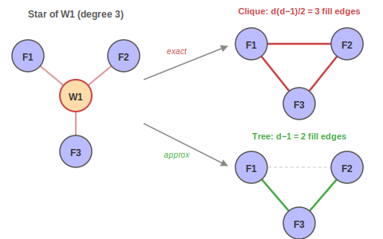

# Part 3: Local Solvers and Approximate Cholesky

This is Part 3 of the algorithm documentation for the `within` solver. It describes the local solve strategies used within each Schwarz subdomain: bipartite-to-Laplacian transformation, Schur complement reduction, and approximate Cholesky factorization.

**Series overview**:
- [Part 1: Fixed Effects and Block Iterative Methods](1_fixed_effects_and_block_methods.md)
- [Part 2: Preconditioned Krylov Solvers and Schwarz Decomposition](2_solver_architecture.md)
- **Part 3: Local Solvers and Approximate Cholesky** (this document)

**Prerequisites**: Part 1 (Gramian block structure), Part 2 (Schwarz framework, Laplacian connection).

---

## Notation

Symbols from Parts [1](1_fixed_effects_and_block_methods.md) and [2](2_solver_architecture.md), plus:

| Symbol | Meaning |
|--------|---------|
| $n_q, n_r$ | Number of active levels in the local subdomain for factors $q, r$ |
| $C$ | Cross-tabulation block restricted to the subdomain (local) |
| $L$ | Sign-flipped Laplacian matrix |
| $S$ | Schur complement of the eliminated block |
| $\tilde{L}$ | Approximate Cholesky factor |

---

## 1. The Local System

Each subdomain requires solving a system $A_i z_i = r_i$ where $A_i$ is the bipartite Gramian block for a factor pair restricted to a connected component. The local operator is:

$$
A_i = G_{\text{local}} = \begin{pmatrix} D_q & C \\ C^\top & D_r \end{pmatrix}
$$

where $D_q$, $D_r$ are the (diagonal) weighted-count matrices and $C$ is the cross-tabulation, all restricted to the component's active levels. This is an $(n_q + n_r) \times (n_q + n_r)$ sparse matrix.

Two solver strategies are available: full Laplacian factorization and Schur complement reduction.

---

## 2. Laplacian Connection

To apply the approximate Cholesky factorization (which requires a Laplacian input), the bipartite Gramian is transformed via sign-flip (as described in [Part 2, Section 2.3](2_solver_architecture.md#23-laplacian-connection-via-sign-flip)):

$$
L = \begin{pmatrix} D_q & -C \\ -C^\top & D_r \end{pmatrix}
$$

This is always a graph Laplacian: every observation at level $j$ of factor $q$ has exactly one level in factor $r$, so $D_q[j,j] = \sum_k C[j,k]$ and all row sums are exactly zero.

The local solve wrapper handles the sign convention:

1. **Before solve**: negate the second block of the RHS ($r[n_q \ldots] \leftarrow -r[n_q \ldots]$), subtract the mean
2. **Solve**: $L z = r$ via approximate Cholesky
3. **After solve**: negate the second block of the solution ($z[n_q \ldots] \leftarrow -z[n_q \ldots]$)

While the original bipartite blocks are always exact Laplacians, downstream transformations (approximate Schur complement via clique-tree sampling, or approximate Cholesky intermediate systems) may introduce small row-sum deficits. When this happens, **Gremban augmentation** adds one extra "ground" node connected to all others, absorbing the deficit. The augmented system is one dimension larger ($n_q + n_r + 1$) but is guaranteed to be a valid Laplacian.

Depending on the solve path, the local system may or may not need sign-flipping (bipartite blocks do, Schur complement outputs are already Laplacian) and may or may not need augmentation (exact operations preserve zero row-sums, approximate ones may not).

---

## 3. Schur Complement Reduction

For the bipartite structure, block Gaussian elimination can reduce the system size before factorization.

Note that applying approximate Cholesky directly to the full Laplacian is equivalent to Schur complement reduction with the same clique-tree sampling rule (up to vertex ordering). Because the graph is bipartite, vertices in the eliminated block have no edges to each other — their eliminations are independent regardless of order, producing the same reduced system on the kept block. Schur complement reduction is therefore always preferred: it makes this independence explicit, enables parallel elimination of the entire block, and yields a smaller system for the subsequent approximate Cholesky factorization.

Given:

$$
\begin{pmatrix} D_q & -C \\ -C^\top & D_r \end{pmatrix}
\begin{pmatrix} z_q \\ z_r \end{pmatrix}
= \begin{pmatrix} b_q \\ b_r \end{pmatrix}
$$

Eliminate the larger block (say $D_q$ when $m_q \geq m_r$). Since $D_q$ is diagonal, elimination is exact and cheap:

$$
S\, z_r = b_r + C^\top D_q^{-1} b_q
$$

where the **Schur complement** is:

$$
S = D_r - C^\top D_q^{-1} C
$$

The Schur complement $S$ is an $m_r \times m_r$ Laplacian on the smaller factor's levels, with edge weights that capture the indirect connections through the eliminated factor. After solving for $z_r$, back-substitution recovers:

$$
z_q = D_q^{-1}(b_q + C\, z_r)
$$

The figure below illustrates the core operation for a single eliminated vertex. Worker W1, connected to firms F1, F2, and F3, forms a degree-3 star. Exact elimination replaces this star with the complete clique on its firm neighbors — $\binom{3}{2} = 3$ fill edges. The approximate variant instead samples a random spanning tree with only $d - 1 = 2$ edges, preserving the expected Laplacian (dashed: the edge not sampled).

Since workers share no edges in the bipartite graph, all worker eliminations are independent and can proceed in parallel — each star's fill depends only on its own edges.

### 3.1 Exact Schur complement

For each row $i$ of the kept block, scatter into a dense workspace:

$$
S[i, j] = D_{\text{keep}}[i] \cdot \delta_{ij} - \sum_{k} \frac{C_{\text{keep} \to \text{elim}}[i,k] \cdot C_{\text{elim} \to \text{keep}}[k,j]}{D_{\text{elim}}[k]}
$$

The workspace is reset sparsely (only touched entries) after each row. Rows are computed in parallel.

**Fill-in and structure.** Since this is exact elimination of the entire larger block, every eliminated vertex $k$ with $d$ neighbors in the keep-block contributes a dense clique of $\binom{d}{2}$ edges to $S$. In the worst case (a single high-degree vertex connected to all kept levels), the Schur complement is fully dense. In practice, the bipartite structure limits fill: most eliminated vertices connect to only a few kept levels, so $S$ remains sparse — but it can be substantially denser than the original bipartite block.

Crucially, exact elimination preserves the Laplacian property: each row sum of $S$ is exactly zero because $\sum_j C[k,j] = D_q[k,k]$ in the parent Laplacian, so the clique contributions cancel perfectly. The result is a valid Laplacian that can be factored directly by approximate Cholesky. The approximate variant below (Section 4.2) replaces cliques with sampled trees for sparsity, but this trades the exact Laplacian property for SDDM (the row sums become non-negative rather than zero), requiring Gremban augmentation to restore a Laplacian.

### 3.2 Approximate Schur complement (clique-tree sampling)

The exact Schur complement $S = D_{\text{keep}} - C_{\text{k} \to \text{e}} \, D_{\text{elim}}^{-1} \, C_{\text{e} \to \text{k}}$ can be decomposed as a sum of rank-1 contributions, one per eliminated vertex:

$$
S = D_{\text{keep}} - \sum_{k=1}^{n_{\text{elim}}} \frac{1}{D_{\text{elim}}[k]} \, c_k \, c_k^\top
$$

where $c_k$ is the column of $C_{\text{k} \to \text{e}}$ corresponding to eliminated vertex $k$ (i.e., the edge weights from $k$ to its neighbors in the keep-block). Each rank-1 term $c_k c_k^\top / D_{\text{elim}}[k]$ is a weighted clique on the neighbors of $k$ — if vertex $k$ has $d$ neighbors, this clique has $\binom{d}{2}$ edges, which can be expensive to materialize.

**The key insight** from Gao, Kyng, and Spielman (2025): each rank-1 clique can be approximated by a random spanning tree of the star graph centered at $k$. A spanning tree has only $d - 1$ edges (linear in degree, not quadratic), and its edge weights can be chosen so that the expected Laplacian of the tree equals the rank-1 clique's Laplacian. This makes clique-tree sampling an **unbiased estimator** of each eliminated vertex's Schur complement contribution.

Concretely, for eliminated vertex $k$ with neighbors $u_1, \ldots, u_d$ having weights $w_1, \ldots, w_d$ and $s_k = D_{\text{elim}}[k]$:
- The exact clique adds edge $(u_i, u_j)$ with weight $w_i w_j / s_k$
- The sampled tree adds $d - 1$ edges whose expected Laplacian matches the clique Laplacian

Edges from all eliminated vertices are sorted, deduplicated (summing weights for duplicate edges), and merged across threads via a parallel reduce tree. The result is assembled into a symmetric CSR Laplacian.

---

## 4. Approximate Cholesky Factorization

The approximate Cholesky algorithm (Gao, Kyng, and Spielman, 2025) factors a Laplacian $L$ into an approximate lower-triangular factor $\tilde{L}$ such that $\tilde{L}\tilde{L}^\top \approx L$. It is applied to the (exact or approximate) Schur complement from Section 3.

The algorithm is a modified Gaussian elimination that processes vertices in a random order. At each step, eliminating a vertex produces fill — but instead of materializing exact fill, it samples an approximation with far fewer edges.

### 4.1 Elimination as rank-1 update

Eliminating vertex $v$ with edge weights $w_1, \ldots, w_d$ to neighbors $u_1, \ldots, u_d$ and diagonal $s_v = \sum_i w_i$ produces the rank-1 Schur complement contribution:

$$
\Delta S = \frac{1}{s_v} \begin{pmatrix} w_1 \\ \vdots \\ w_d \end{pmatrix} \begin{pmatrix} w_1 & \cdots & w_d \end{pmatrix}
$$

As a Laplacian, this is a complete graph (clique) on $N(v)$ with edge $(u_i, u_j)$ weighted $w_i w_j / s_v$.

Standard Cholesky would materialize all $\binom{d}{2}$ clique edges as fill, potentially leading to dense factors.

### 4.2 Clique-tree sampling

Instead of materializing the $O(d^2)$ clique edges, sample a random spanning tree of the star graph $\{v\} \cup N(v)$. The tree has exactly $d - 1$ edges. Edge weights are set so that the expected Laplacian of the tree equals the clique Laplacian — an **unbiased estimator** with $O(d)$ fill instead of $O(d^2)$.

This is the same core operation used in Section 3.2 for the approximate Schur complement. The difference is that Schur complement reduction eliminates the entire larger block at once (all vertices independently, in parallel), while approximate Cholesky eliminates vertices one by one. Each elimination creates fill edges that become part of the graph for subsequent steps, so the order matters:

Eliminating F1 creates a fill edge F2–F4. When F2 is eliminated next, it now connects to F4 (via the fill from step 1), producing further fill F3–F4. This cascading fill is why the Schur complement reduction — which exploits the bipartite independence — is performed first, and approximate Cholesky is applied only to the smaller reduced system.

### 4.3 Properties

The key property is that $\mathbb{E}[\tilde{L}\tilde{L}^\top] = L$ (unbiased). Gao, Kyng, and Spielman (2025) provide the full algorithm and analysis.

---

## References

**Gao, Y., Kyng, R., & Spielman, D. A.** (2025). *Robust and Practical Solution of Laplacian Equations by Approximate Gaussian Elimination*. arXiv:2303.00709. Primary reference for the approximate Cholesky factorization via clique-tree sampling (AC(k) algorithm), Schur complement approximation, and Gremban augmentation.

**Gremban, K. D.** (1996). *Combinatorial Preconditioners for Sparse, Symmetric, Diagonally Dominant Linear Systems*. PhD thesis, Carnegie Mellon University. SDDM-to-Laplacian augmentation technique.
