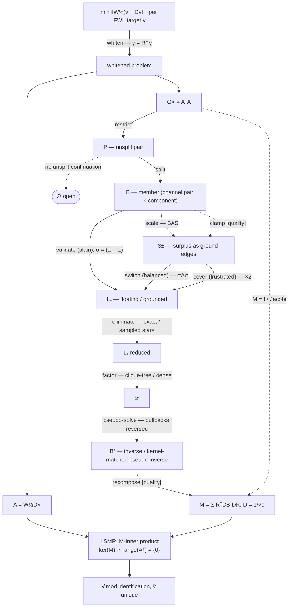

# 4. SDDM / Laplacian State Model

States = matrix classes (invariants). Edges = transforms (domain, exactness,
pullback). Code is audited against the model: a code path with no legal edge is
a bug or a missing theorem. Tags: **[exact]**, **[quality]** (costs iterations,
never correctness), **[def]** (definitional boundary), **[open]** (missing
mathematics).

## Problem

$$
y = X\beta + \sum_f D_f\,\gamma_f + \varepsilon ,\qquad
c_f(o) = \bigl(1,\ z_{f,1}(o),\ \ldots\bigr) \in \mathbb{R}^{V_f} ,\qquad
(D_f\gamma_f)(o) = c_f(o)^\top \gamma_{f,\,\ell_f(o)}
$$

FWL: per target $v$ solve

$$
\tilde v = v - D\hat\gamma ,\qquad
\hat\gamma \in \operatorname{argmin}_{\gamma}\, \lVert v - D\gamma \rVert_W .
$$

1. $D\hat\gamma$ (hence $\tilde v$) is the unique $W$-orthogonal projection ⇒
   correctness = minimizer-set membership = "correct mod identification"; the
   kernel rule below is exactly this condition.
2. Plain-FE kernel is combinatorial: per connected component,
   dim = participating factors − 1 (generic); slopes add kernel only through
   within-component loading collinearity.
3. $A^\top b \in \operatorname{range}(G)$: the normal equations are always
   consistent.

**whiten** acts on the problem itself, before anything else forms: per level
$\ell$ of each slope-bearing term (pivoted Gram–Schmidt, slopes centered on
the intercept),

$$
M_\ell := \sum_{o \in \ell} w\, c\,c^\top = R_\ell^\top \Delta_\ell R_\ell ,\qquad
D \mapsto D^\circ = D\,R^{-1} \ \text{blockwise}.
$$

Pullback $\gamma = R^{-1}\hat\gamma$, applied once at return; $\tilde v$
invariant. $M_\ell u = 0$ ⇒ $u$ is a zero row of the whole Gramian ⇒ exits
here as an exact-zero column; the min-norm iteration returns exact-$0$
coefficients. Only cross-channel *orthogonality* is load-bearing (it makes
**split** exact); the leftover positive per-level scalings ($\Delta_\ell$)
commute into **scale** — vacuous for plain pairs.

Both lanes are whitened:

$$
\begin{aligned}
A &= W^{1/2} D^\circ && \text{operator lane — exact matvecs, never assembled}\\
G^\circ &= A^\top A && \text{preconditioner lane — formed per factor pair}
\end{aligned}
$$

## Normal form

Signed grounded Laplacian: $n+1$ vertices (ground $g$); off-diagonals are
edges (attractive $<0$, repulsive $>0$); diagonal $=$ sum of off-diagonal
magnitudes. Surplus ≡ edge to $g$; SDDM = grounded Laplacian minus its ground
row and column. Grounding isomorphism [exact]:

$$
S\,x = b
\iff
L_+\hat x = \begin{pmatrix} b \\ -\mathbf{1}^\top b \end{pmatrix} ,
\qquad
x = \hat x_{\mathrm{keep}} - \hat x_g\,\mathbf{1} .
$$

| component | kernel |
|---|---|
| unsigned, no ground path | $\mathbf{1}$ |
| balanced signed, no ground path | switching signature $\sigma$ |
| frustrated, or any ground path | $0$ — positive definite |

## States

| state | invariants |
|---|---|
| **G∘** | PSD; channels orthogonal within each level (slope channels orthonormal); cross-factor blocks bipartite, assembled from rank-1 stamps $w\,\tilde c_f \tilde c_g^\top$ |
| **P** | connected principal submatrix on *all* channels of two factors ≃ matrix-weighted bipartite Laplacian, rank-1 PSD block weights |
| **B** | member: one channel per factor, one connected component; $\begin{bmatrix} D_q & C \\ C^\top & D_r \end{bmatrix}$, $D$ diagonal, $C$ signed |
| **S±** | signed SDD; row surplus explicit as ground-edge weight |
| **L₊** | grounded Laplacian ≡ SDDM; *floating* ($\ker = \mathbf{1}$) or *grounded* (PD) |
| **𝓛** | $\mathcal{L}\mathcal{L}^\top = X$ [exact] or $\mathbb{E}[\mathcal{L}\mathcal{L}^\top] = X$ [sampled], $X$ the source; rank = source, surely |
| **B⁺** | member solve action: grounded → $B^{-1}$; floating → kernel-matched pseudo-inverse (not Moore–Penrose) |
| **M** | $M = \sum_i R_i^\top \tilde D_i B_i^+ \tilde D_i R_i$, $\tilde D = 1/\sqrt{c}$ partition of unity ($\sum_i R_i^\top \tilde D_i^2 R_i = I$ on covered DOFs); symmetric PSD; applied once per iteration |

Predicates on **B**: **balanced** — $\exists\,\sigma \in \{\pm 1\}^n$ with
$\sigma A \sigma \le 0$ off-diagonal (no frustrated cycle; plain pairs always,
slope pairs generically not); **generalized dominance** — $\exists\,S > 0$
diagonal with $SAS$ weakly dominant (plain pairs tightly; PSD does not imply
it).

## Edges

| edge | domain → codomain | action | tag | pullback |
|---|---|---|---|---|
| whiten | problem → whitened problem | per-level congruence $R^{-1}$ | exact | $\gamma = R^{-1}\hat\gamma$ at return |
| restrict | G∘ → P | principal submatrix, one factor pair | exact¹ | — |
| split | P → {B} | one member per channel pair, per component; exact partition of coupling; members overlap on shared channels | exact | via recompose |
| validate | plain B → L₊ | check row sums ≡ diagonals (roundoff); adopt $\sigma = (\mathbf{1}_q, -\mathbf{1}_r)$ | exact | $x = \sigma \circ \hat x$ |
| scale | dominant B → S± | $A \mapsto SAS$, $S$ certified by monotone fixed point | exact | $x = S\hat x$ |
| clamp | ¬dominant B → S± | diagonal lift $d_i \mapsto \max\bigl(d_i, \sum_j \lvert a_{ij}\rvert\bigr)$ — operator perturbation | quality | — |
| switch | balanced S± → L₊ | $A \mapsto \sigma A \sigma$, fused with scale; surplus → ground edges; floating ⟺ total surplus ≤ roundoff | exact | $x = \sigma \circ \hat x$ |
| cover | frustrated S± → L₊ ($2n$) | Gremban double cover; balanced ⟺ cover disconnects | exact | $x = (x^+ - x^-)/2$ |
| eliminate | L₊ → L₊ | Schur on the larger bipartite side: independent set ⇒ pivots = original diagonals; ground kept; eliminated surplus joins its star (capacity = pivot) | exact rows / sampled per-star clique-tree (unbiased, kernel sure, no spectral guarantee; exact on ≤ 2-entry stars) | back-substitution |
| factor | L₊ → 𝓛 | clique-tree to completion (ground ordinary) / dense Cholesky (floating: anchored minor = grounding, benign) | sampled / exact | substitution |
| pseudo-solve | 𝓛 → B⁺ | compose pullbacks in reverse; floating: mean-project RHS and solution; grounded: gauge $(b, -\mathbf{1}^\top b)$, $x = \hat x - \hat x_g$ | — | is the pullback |
| recompose | {B⁺} → M | the PoU sum of the states table | quality — **the** approximation locus | — |

¹ below restrict everything is quality-only, except the kernel rule.

Boundaries (first-class, not omissions):

- **P → ∅ [open]** — every notion below B is scalar (balance, dominance,
  sampling probabilities = entries); matrix-weighted elimination theory exists
  only for scaled-unitary weights — rank-1 stamps lie outside it. The channel
  split is forced, not chosen.
- **¬dominant [def]** — no scaling exists; clamp is the only entry.
- **degenerate termini** — no factor pair ⇒ $M = I$; or $M =$ Jacobi diagonal.
  Both definite ⇒ always legal; quality-only.

## Diagram

mermaid source (regenerate the SVG from this)

The clique-tree rule is undefined outside L₊: its probabilities are the
entries, so one repulsive edge is a negative probability — [def], not [open]:
a magnitude-sampler generalization is well-defined and unbiased on S±, but is
not the adopted algorithm.

## Sampled Schur: input contract

Clique-tree sampling of Gao–Kyng–Spielman, *AC(k)* (SISC 2025;
arXiv:2303.00709). Valid input — **SDDM**, grounded to $X\mathbf{1} = 0$:

$$
X = X^\top ,\qquad
X_{ij} \le 0 \ (i \ne j) ,\qquad
X_{ii} \ge \sum_{j \ne i} \lvert X_{ij} \rvert .
$$

Step, for vertex $v$ with $a := -X_{:,v} \ge 0$ and pivot
$d := X_{vv} = \mathbf{1}^\top a$:

$$
\mathrm{Sc}[X] = (X - \mathrm{Star}_v) + \mathrm{Clique}_v ,\qquad
\mathrm{Clique}_v = \sum_{i<j} \frac{a_i a_j}{d}\, b_{ij} b_{ij}^\top .
$$

Per-neighbor star $i \to \{j > i\}$: sample one $j \propto a_j$ with weight
$a_i \sum_{l>i} a_l / d$ (independent of the drawn $j$). AC($k$): split each
entry into $k$ multi-edges first.

| axiom | consequence |
|---|---|
| symmetry + zero row sums | pivot dichotomy $d = \mathbf{1}^\top a$: zero pivot ⟺ zero column — once per component, at its last vertex; no pivoting |
| off-diagonals $\le 0$ | $a \ge 0$ ⇒ clique weights $a_i a_j / d \ge 0$, the sampling rule is a probability, sampled weights $\ge 0$; one repulsive edge ⇒ a negative probability — undefined, not inaccurate |
| all three | closure: $X - \mathrm{Star}_v$, $\mathrm{Clique}_v$, and every sample are Laplacians ⇒ the axioms hold again at every step, surely |
| star ordering ($j > i$) | samples form a tree on the neighbors ⇒ connectivity, rank, kernel preserved surely |
| unbiasedness | $\mathbb{E}[\mathcal{L}\mathcal{L}^\top] = X$ |

Not assumed: definiteness, connectivity, spectral conditions, elimination
order. Not provided: any quality guarantee — AC($k$) proves unbiasedness, sure
rank/kernel preservation, $O(mk \log m)$ nonzeros; the $O(1)$-condition
theorem is Kyng–Sachdeva's heavier sampler.

## Kernel: the two places it matters

1. **Inside elimination** — bookkeeping only: zero pivots occur exactly at
   component-last vertices and are skipped; kernel dim = # floating
   components.
2. **Outside** — LSMR via Golub–Kahan, $M$-inner-product form.
   Unpreconditioned: the v-chain lies in $R := \operatorname{range}(A^\top)$,
   invariant under the recurrence ⇒ limit $= A^+ b$ — kernel-immune. With
   $M$: iterates $\in \operatorname{range}(M)$, limit
   $= \operatorname{argmin}\{\lVert Ax - b\rVert : x \in
   \operatorname{range}(M)\}$, stopping quantity = the $M$-seminorm of the
   normal residual — identically zero on $\ker(M)$.

**Rule: correct (mod identification) $\iff \ker(M) \cap R = \{0\}$.**

| $\ker(M)$ | outcome |
|---|---|
| $= 0$ (grounding a singular component) | benign; representative is min-norm in the $M^{-1}$-metric |
| $= \ker(A)$ (kernel-matched pseudo-solve) | benign; $\ell_2$ min-norm preserved exactly |
| $\ne 0$, $\cap\, R = \{0\}$ (e.g. uncovered zero columns) | benign; the kernel absorbs the deflation |
| $\cap\, R \ne \{0\}$ (deflating a "constant" on a PD component) | fatal and **silent**: the stopping quantity vanishes at the restricted optimum, the true residual does not |

$\ker(M) = \bigcap_i \ker$ of the member terms: a direction survives ⟺ it
touches no grounded member and every floating member it touches sees its own
indicator (uncovered DOFs survive trivially, and lie in $\ker(A)$). So the
floating/grounded call at **switch** is the single decision selecting the
table row. Quality errors in $M$ cost visible iterations; range errors change
which problem is solved, invisibly.

## Status

- **Verified 2026-07-11** — sampled-Schur input contract (independent
  derivation, falsification experiments, checked against implementation);
  kernel rules for the preconditioned bidiagonalization (derivation, numerics,
  implementation); end-to-end edge audit against the implementation
  (problem-level whiten, per-member classification, validate/scale/switch/
  clamp with explicit ground surplus, bipartite eliminate, dense/anchored
  factor, pseudo-solve chain incl. grounding gauge, PoU recompose).
- **Standard, adopted** — FWL and residual invariance; congruences (Sylvester);
  grounding isomorphism; exact Schur closure and clique decomposition
  (AC(k) §3.1); Gremban cover exactness; additive-Schwarz symmetry/PSD-ness
  under two-sided PoU weights.
- **Open** — elimination theory for rank-1-block matrix-weighted Laplacians
  (state P); connection-Laplacian theory needs scaled-unitary weights.
